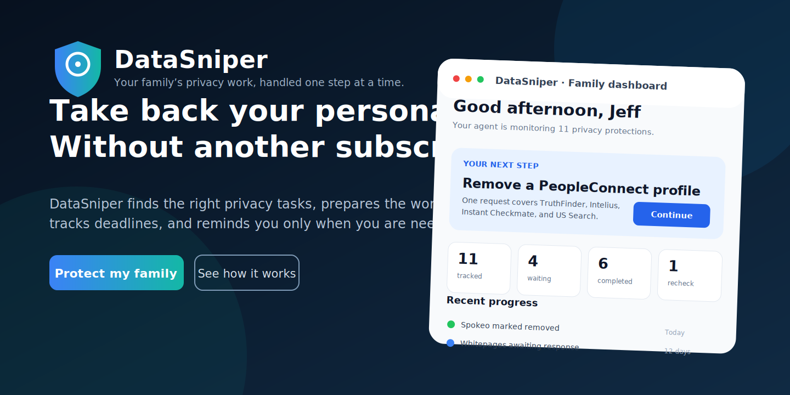
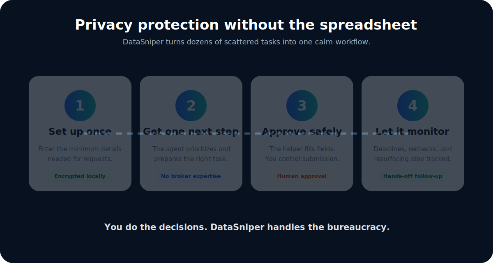
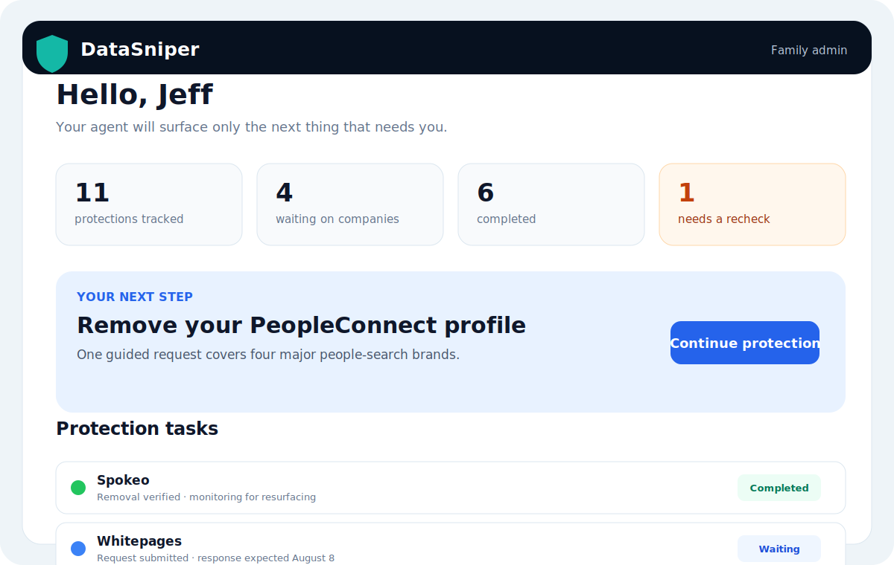
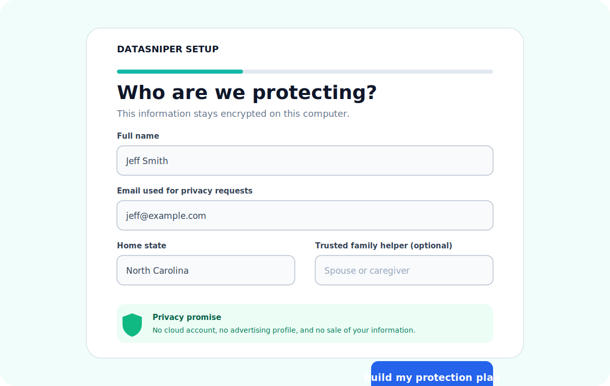
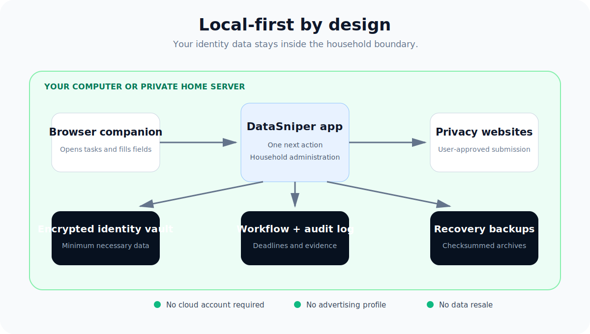

<p align="center">
  
</p>

<p align="center"><strong>Take back your personal data—without another subscription.</strong></p>

<p align="center">
  DataSniper is a local-first privacy agent that prepares data-broker removal work, guides safe submission, tracks deadlines, and tells your family only when human attention is actually needed.
</p>

<p align="center">
  <a href="../../actions/workflows/ci.yml"></a>
  
  
  
  
</p>

<p align="center">
  <a href="#get-started">Get started</a> ·
  <a href="#see-datasniper-in-action">See the product</a> ·
  <a href="#why-use-datasniper">Why DataSniper</a> ·
  <a href="#frequently-asked-questions">FAQ</a> ·
  <a href="SECURITY.md">Security</a>
</p>



## The privacy problem is not one form

Removing personal information from the internet is repetitive, confusing, and easy to abandon. Every company has a different page, a different verification method, and a different response window. Even after a listing disappears, it may return months later.

DataSniper turns that bureaucracy into a household workflow:

1. Complete one plain-language setup.
2. Receive one prioritized privacy task at a time.
3. Let the browser companion match visible records and fill recognized fields.
4. Automatically submit supported forms, with a handoff for CAPTCHAs, consent, or ambiguity.
5. Let DataSniper record every transaction and track confirmations, deadlines, rechecks, and resurfacing.

> **You make the decisions. DataSniper handles the administrative work.**

## Privacy autopilot

DataSniper now has a local automation control plane in addition to its removal
ledger. Versioned broker adapters score visible records against encrypted
identity variants, fill recognized fields, enforce per-broker authorization and
match thresholds, and verify the resulting confirmation page. Supported
workflows can submit automatically; ambiguous matches, CAPTCHAs, ID uploads,
consent choices, and legal attestations are placed in a human-action queue.

The daily runner also health-tests adapters, applies bounded exponential retry
windows, records every state transition, captures encrypted before/after
evidence, reconciles a dedicated IMAP inbox, and reports an honest per-broker
support score (`full`, `assisted`, `manual`, `captcha`, or `broken`). Mail bodies
are classified locally and are not retained.

Optional mailbox configuration:

```text
DATASNIPER_IMAP_HOST=imap.example.com
DATASNIPER_IMAP_USERNAME=privacy@example.com
DATASNIPER_IMAP_PASSWORD=app-password
DATASNIPER_IMAP_FOLDER=INBOX
```

## Why use DataSniper?

### Stop maintaining a privacy spreadsheet

DataSniper records what was prepared, submitted, confirmed, removed, denied, or scheduled for another check. You no longer need to remember which company promised what—or when to look again.

### Protect a household, not just one browser

The interface is designed for spouses, caregivers, and trusted family helpers. Large controls, plain language, and one clear next action make privacy work approachable for people who do not live in technology.

### Keep identity data out of another company’s cloud

The identity vault and workflow database remain on your computer or private home server. DataSniper does not require an advertising profile, analytics account, or hosted identity repository.

### Avoid another permanent subscription

DataSniper is being built as software you control. The household beta does not require a monthly privacy-service subscription.

### Preserve evidence

Requests, dates, confirmations, outcomes, and audit events stay organized. Recovery archives include integrity checks so a household administrator can verify that a backup has not changed.

## See DataSniper in action



### One calm dashboard



The primary screen answers three questions: **What needs me now? What is waiting? What has been completed?** Technical workflow states remain available without dominating the experience.

### Setup written for ordinary people



DataSniper asks for the minimum information needed to prepare privacy work and explains why it is requested. Sensitive values are encrypted locally.

> Screens shown above are product previews based on the current application workflow. Exact appearance may change as accessibility testing continues.

## DataSniper compared

| Capability | DataSniper | Doing it manually | Typical managed service |
|---|:---:|:---:|:---:|
| Local encrypted identity vault | ✅ | Usually not | Usually cloud-hosted |
| One prioritized next action | ✅ | ❌ | Varies |
| Deadline and recheck tracking | ✅ | Manual | ✅ |
| Family-helper workflow | ✅ | Ad hoc | Varies |
| Browser-assisted form filling | ✅ | ❌ | Hidden from user |
| User controls legal attestations | ✅ | ✅ | Varies |
| No recurring subscription required | ✅ | ✅ | Usually ❌ |
| Transparent audit history | ✅ | Only if maintained | Varies |
| Works on a private home server | ✅ | N/A | Usually ❌ |

DataSniper is not a magic deletion button. It is a transparent, evidence-driven assistant that reduces the work while keeping consequential decisions with the person or their authorized helper.

## Privacy architecture



Core safeguards include:

- Encrypted identity values at rest
- Argon2 household-administrator passwords
- Localhost-only default network exposure
- Strict sessions, trusted-host checks, and origin protection
- No-store browser responses and defensive security headers
- Consistent SQLite recovery backups with SHA-256 checksums
- Non-root, read-only Docker deployment with dropped capabilities
- Daily breach monitoring with locally encrypted findings (optional HIBP API key)
- Free padded k-anonymous password exposure checks; passwords are never stored
- Daily broad-coverage audits of the current California registry and the Apache-2.0-licensed 2025 CPPA-derived archive published by CalMatters/The Markup
- Human approval before submission, identification upload, attestations, appeals, or complaints

Read the full [privacy statement](PRIVACY.md) and [security policy](SECURITY.md).

## Get started

### Recommended: Docker Desktop

This keeps installation predictable and isolates the application from the rest of the computer.

```bash
git clone https://github.com/grumpystrongman/DataSniper.git
cd DataSniper
cp .env.example .env
docker compose up -d --build
```

Open `http://127.0.0.1:8787`, create the household administrator password, and follow the guided setup.
Docker Compose starts a private Ollama sidecar, checks the persistent local
model volume, and downloads the pinned Qwen3-VL model only when it is missing.
The Ollama port is not exposed to the host or local network. The first startup
may take several minutes while the model is downloaded; later starts reuse the
local copy.

### Python

Python 3.11 or newer is supported.

```bash
git clone https://github.com/grumpystrongman/DataSniper.git
cd DataSniper
python -m venv .venv
```

Windows:

```powershell
.\install.ps1
python run.py
```

macOS or Linux:

```bash
./install.sh
python run.py
```

The installer checks for DataSniper's private local intelligence runtime and
the pinned Qwen3-VL model, installs or downloads missing components, verifies
that the model can be opened, and installs Chromium. In normal use the model is
managed silently. It listens only on the local computer, receives sanitized
page structure rather than household values, proposes constrained actions, and
cannot submit forms or access arbitrary tools. DataSniper's policy engine and
Playwright worker remain the only components allowed to act.

### Browser companion

Until Chrome and Edge store releases are available:

1. Open the browser’s extension-management page.
2. Enable developer mode.
3. Select **Load unpacked**.
4. Choose the `browser-extension` folder.
5. Start DataSniper. The companion pairs with the local service.

The companion can open the current privacy task and fill recognized fields. It intentionally does **not** submit forms, bypass CAPTCHAs, upload identity documents, or accept legal language.

## What DataSniper handles today

- Encrypted local identity storage
- Plain-language household onboarding
- State-aware starter protection plans
- Grouped PeopleConnect coverage
- California DROP guidance for California residents
- People-search and prescreening privacy tasks
- Request preparation and confirmation tracking
- Expected-response and verification dates
- Removed, no-record, waiting, failed, and resurfaced outcomes
- Local audit history
- Browser-assisted form filling
- Automatic monitoring and weekly recovery backups
- Daily health audit of free, official broker-removal links
- Automatic plan sync when a newly reviewed catalog entry becomes available
- Encrypted identity variants for former names and contact details
- Encrypted, request-specific evidence attachments
- Daily resurfacing checks for user-saved public profile URLs
- Structured verification-email and broker-response status tracking
- Household administrator authentication
- Hardened Docker operation

## Frequently asked questions

### Does DataSniper guarantee deletion?

No. A company may suppress a public listing without deleting every backend record, may qualify for an exemption, or may require additional verification. DataSniper records the strongest outcome supported by evidence instead of overstating success.

### Does DataSniper upload my personal information?

Not by default. The household product stores identity and workflow data locally. Opening a broker’s website necessarily sends information that you choose to enter or submit to that broker.

### Can I use it for my spouse, parent, or child?

Yes, when you have their permission or legal authority. DataSniper supports trusted-family assistance, but software cannot create authority that does not exist.

### Is this an automatic bot?

It automates preparation, sequencing, deadlines, reminders, and recognized form fields. It stops for CAPTCHA challenges, identity documents, attestations, final submissions, appeals, and complaints.

### Why not expose it to the public internet?

DataSniper contains sensitive household identity data. The supported household deployment is a private computer or home server bound to localhost. Remote access should use a carefully configured private network or VPN, not an open port.

### Does it work outside the United States?

The architecture can support other jurisdictions, but the current starter catalog and rights logic are focused on United States workflows.

### Is it ready for paying customers?

Not yet. It is a production-oriented **household beta** for the repository owner and trusted family. A public commercial release still requires signed installers and updates, browser-store review, independent security testing, counsel review, granular delegated accounts, broader verified adapters, formal accessibility testing, and support operations.

## Roadmap

- [x] Local encrypted privacy vault
- [x] Guided household setup
- [x] One-next-action dashboard
- [x] Deadline and resurfacing tracking
- [x] Browser companion
- [x] Household authentication and backups
- [x] Docker hardening and CI security audit
- [ ] Signed Windows installer with embedded runtime
- [ ] Signed automatic updates and rollback
- [ ] Chrome and Edge store publication
- [ ] Separate family-member and helper permissions
- [x] Verified removal-link catalog with daily change monitoring
- [x] Identity variants, encrypted evidence, and resurfacing monitoring
- [ ] Maintainer-reviewed registry import for discovering new broker candidates
- [x] Manual confirmation-email status tracking
- [ ] Optional local mailbox confirmation-email parsing
- [ ] Formal accessibility study with older adults
- [ ] Restore-tested schema migrations
- [ ] Public support and incident-response program

## Development and validation

```bash
pip install -r requirements.txt
pytest -q
python -m compileall -q app.py production.py run.py
```

GitHub Actions tests Python 3.11 and 3.12 and runs a blocking dependency vulnerability audit.

## Responsible use

DataSniper assists with lawful personal privacy administration. Do not use it to impersonate another person, bypass access controls, submit false statements, scrape prohibited systems, or interfere with services.

## Project status and licensing

DataSniper is currently a household beta. Source is published for evaluation and development, but a final public-use and commercial license has not yet been selected. Do not assume permission beyond applicable law and explicit repository notices.

## Contributing

Useful contributions include verified broker workflow updates, accessibility improvements, tests, documentation, and privacy-preserving deployment work. Open an issue before substantial changes so the implementation remains aligned with the local-first safety model.

---

<p align="center"><strong>Privacy protection should not require becoming a privacy expert.</strong></p>
The production service also starts a persistent Chromium worker. It atomically
claims authorized queue items, launches the official privacy page, inspects and
fills the form, submits supported workflows, verifies the response page, and
records live stages and timestamps in the Automation Center. CAPTCHA, identity
documents, legal attestations, and ambiguous required fields stop in an
action-required state with the reason recorded. Set
`DATASNIPER_BROWSER_WORKER=0` to disable execution; `queued` never implies
active execution when the worker is disabled.
